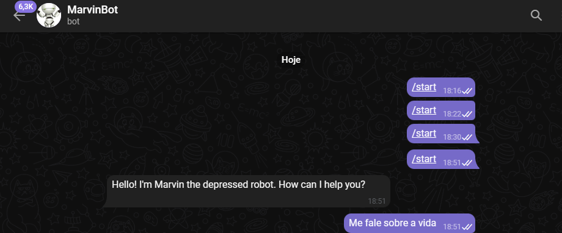

<h1 align="center">
  
</h1>

<h3 align="center">MARVIN BOT</h3>
<h3 align="center">=================</h3>

<p align="center">
  
</p>

<h3>About the project</h3>

<p>The project consisted of developing a chatbot capable of answering questions and generating answers from the book "The Hitchhiker's Guide to the Galaxy". For this, we use an LSTM neural network in conjunction with the tensorflow library to train the model. In addition, we used the spacy library to perform a Named Entity Recognition (NER) analysis on the text of the book, in order to filter the lines of the character Marvin, the paranoid android.

Interaction with the chatbot was done through the Telegram application, and the chatbot instance was hosted on the Heroku service. Finally, we created a flowchart to illustrate the interaction between the different parts of the project.

The general objective of the project was to show how it is possible to create a chatbot capable of generating responses based on a textual corpus and using natural language processing techniques.</p>

<h3>How to Run</h3>

<p>To run the project, there is a simpler way. First, clone the repository to any destination on your machine.</p>

<p> In the root directory, open your terminal and type </p>

```
python scripts/main.py 

```


<h3>Result</h3>
<p align="center">
  
</p>
